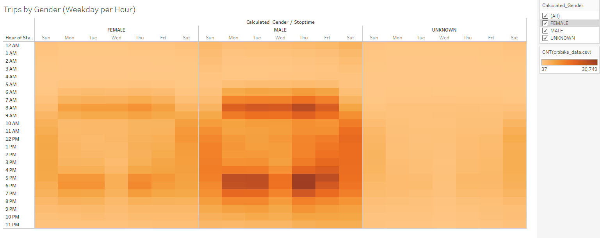
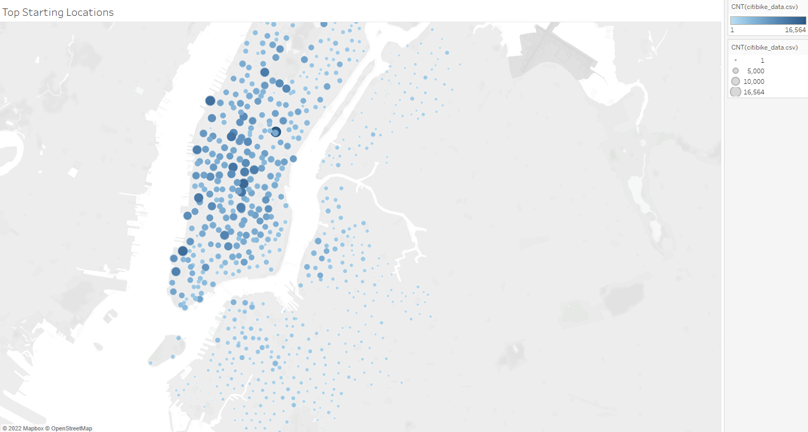
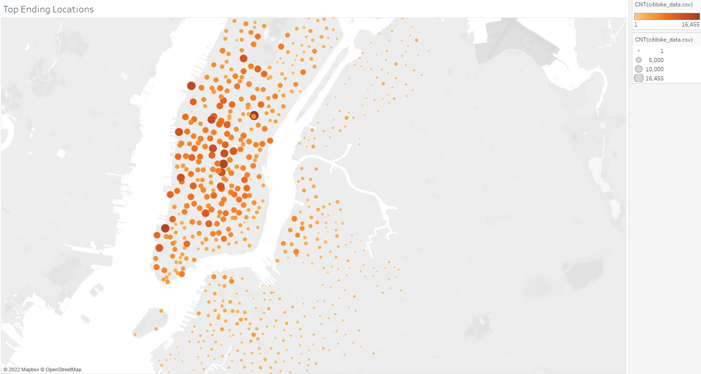

# BikeSharing
## Overview of the statistical analysis
The purpose of these visualizations is to show bike trip analysis to convince investors that bike sharing is viable in the city of Des Moines.
## Results

The timeframe that the bikes are used typically falls between 0 to 20 minutes.

The trend of trip duration stays the same for all three genders, but there is a larger number of uses from males.

The heatmap shows there is an increase in bike usage from 7am-9am and 4pm-7pm on weekdays. This lines up similarly to when users would be headed to or from work.

The heatmaps show a similar trend to the previous map but shows the increase in usage from males compared to female and unknown.

It appears that the usage between genders stays the same to the other visualizations. The difference between subscibers and customers is that there appears to be more usage from customers on the weekends versus the weekdays. The subscribers are the opposite by using the bikes more during the work week versus the weekend.

The starting locations have increased usage in the central parts of Manhattan versus the outskirts.

The ending locations have a simalar layout to the starting locations in usage.
## Summary
All of the visualizations point towards majority usage by the working class. The primary hour usages are during rush hours for people going to and from their place of work. The locations of high usages come from the downtown part of Manhattan where the majority of workplaces are. Two visualizations that I would add would be the start times for starting locations and end times for ending locations.
